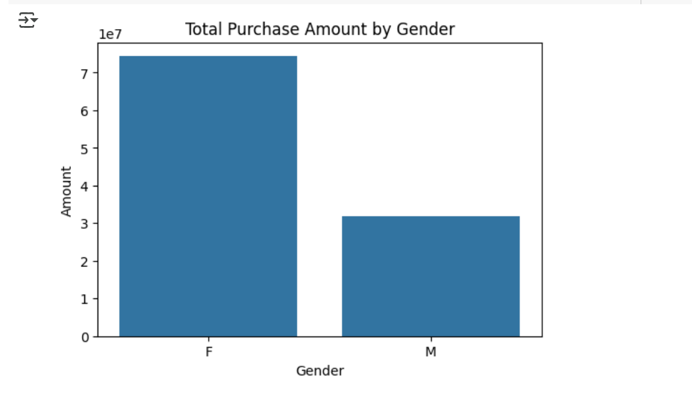
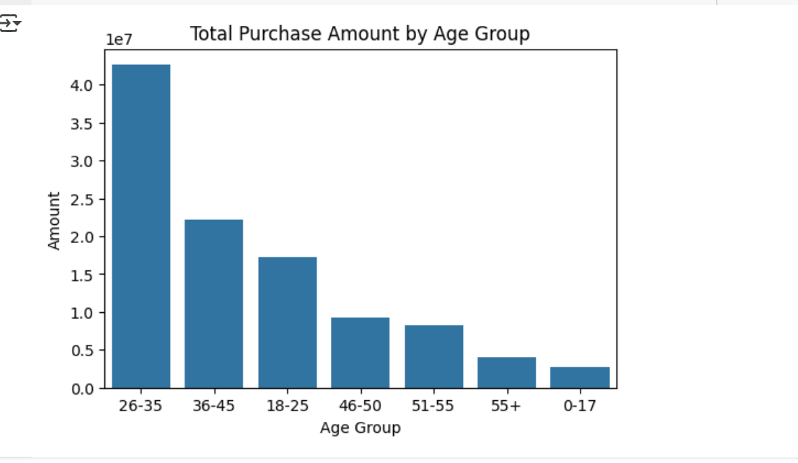

🛍️ New Year Sales Analysis Project

Project Overview
This project focuses on analyzing New Year sales data to uncover purchasing patterns, customer behaviors, and revenue-driving factors. By performing extensive data cleaning, exploratory data analysis (EDA), and visualizations, the goal is to generate actionable insights for business decision-making, particularly in marketing, sales strategies, and customer targeting.

Project Objectives
1. Understand customer demographics and how they influence purchasing behavior.
2. Identify high-performing segments such as top-selling product categories, revenue-driving states, and impactful occupations.
3. Analyze the influence of factors like gender, age group, marital status, and occupation on sales.
4. Explore spending trends across demographics and regions to profile the ideal customer.
5. Answer advanced analytical questions such as category preference by demographic and correlation of age with spending.

Methodology
1. Data Collection
The dataset contains customer transaction records for New Year sales. Key fields: User ID, Age, Gender, Marital Status, State, Occupation, Product Category, Order Count, Amount.
2. Environment Setup
Python environment with numpy, pandas, matplotlib, and seaborn.
3. Data Preprocessing
Imported dataset using proper encoding (ISO-8859-1) to handle special characters. Dropped irrelevant columns (Cust_name, Status, unnamed1). Removed rows with missing values in critical fields like Amount. Converted Amount to integer type for consistent calculations.
4. Data Overview
Performed summary statistics to understand distributions. Checked for unique values to evaluate the diversity of categories and customers.

Exploratory Data Analysis (EDA)
1. Gender Analysis
Count and total purchase amount by gender.
Insight: Helps identify which gender group spends more overall.

2. Age Group Analysis
Distribution of purchases across age groups and genders.
Insight: Identifies the age group with the most transactions and highest revenue.

3. State-wise Analysis
Top 10 states by number of orders and total revenue.
Insight: Pinpoints geographic regions contributing most to business.

4. Marital Status Analysis
Purchase count and total amount by marital status, segmented by gender.
Insight: Understands how marital status influences spending habits.

5. Occupation Analysis
Count and amount of purchases per occupation.
Insight: Identifies professions most engaged with the brand.

6. Product Category Analysis
Popularity and revenue contribution by product category.
Insight: Highlights best-selling categories for marketing focus.

Additional Analytical Questions
1. Which age group contributes most to each product category (by gender)?
Grouped by Product_Category, Age Group, and Gender. Used bar plots to visualize segment-specific preferences.

2. How does spending vary by marital status across age groups?
Analyzed age group vs. marital status vs. total amount spent.

3. Which states generate highest revenue?
Summarized state-wise order volume and revenue.

4. Do specific occupations prefer particular product categories?
Cross-tabulated Occupation and Product_Category for total amount spent.

5. Correlation between age and spending by gender?
Scatter plot of Age vs. Amount, hue by Gender.

Key Findings
1. The 26–35 age group is the most active and spends the most.
2. Females slightly outspend males overall.
3. Maharashtra,and Uttar Pradesh lead in revenue.
4. Married individuals generally spend more than unmarried ones.
5. Healthcare and IT professionals are top spenders.
5. Food and Apparels categories are revenue leaders.

